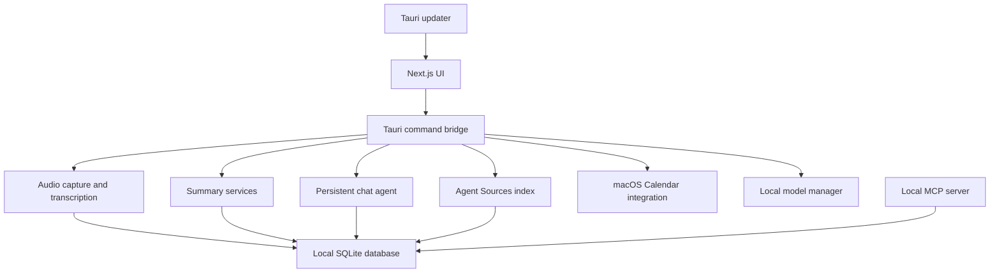

# Architecture

Orxa is a Tauri desktop app with a Next.js UI, a Rust app core, a Rust local-model sidecar, a local SQLite database, and a small Python MCP server.

The supported app path is the bundled desktop app. The legacy Python/FastAPI backend under `backend/` is archived and unsupported for current development.

## Runtime Shape



## Frontend

The frontend lives in `frontend/src`.

Important surfaces:

- `app/page.tsx` is the home/recording entry surface.
- `app/calendar/page.tsx` merges macOS Calendar events with local recordings.
- `app/chat/page.tsx` provides persistent meeting-aware chat.
- `app/meeting-details` displays transcripts, summary modal, recording playback, trim tools, and right-side meeting panels.
- `app/settings` configures recordings, transcription, summaries, chat, playback, Agent Sources, beta options, and MCP setup.
- `components/Sidebar` owns main navigation, recording/import actions, search, update notice, and the collapsed/expanded sidebar state.

## Rust App Core

The Tauri backend lives in `frontend/src-tauri/src`.

Important modules:

- `audio` handles recording, import, device handling, playback, and transcript persistence.
- `calendar.rs` wraps macOS EventKit permission, event listing, and recording/event attachment logic.
- `summary` generates summaries, action items/todos, language handling, templates, and summary cache data.
- `chat.rs` stores local chat sessions and calls the configured chat/summary model with meeting and Agent Sources context.
- `agent_sources.rs` indexes and searches local coding-agent history folders.
- `local_models.rs` downloads model artifacts from Hugging Face or GitHub into app data.
- `mcp.rs` reports MCP setup paths/config to the UI.
- `database` owns SQLite setup, migration, import, and repository helpers.
- `tray.rs` owns menu-bar controls for recording state and update checks.

## Data Model

The local SQLite database stores:

- meetings
- transcript segments
- summary process state and summary payloads
- meeting notes
- chat sessions and messages
- Agent Sources configuration and indexed documents
- settings and model preferences

Calendar events are read from macOS Calendar at view time. Orxa links recordings to events by comparing event start/end times with the recording start time and inferred duration. Recordings without a matching Calendar event remain standalone meetings.

## Agent Sources

Agent Sources are local folders that Orxa indexes for chat context and MCP search. Default/discoverable sources include Codex sessions, Codex memory summaries, Claude session/memory folders, Cursor history, and custom folders configured in Settings.

The chat agent can use Agent Sources context when answering questions or preparing briefs, but it should cite the source/session title rather than pretending that external context came from a meeting transcript.

## MCP

The MCP server in `mcp/orxa_mcp.py` reads the same local SQLite database. It exposes meetings, transcripts, summaries, notes, todos, transcript trimming, and Agent Sources search to tools such as Codex or Claude.

The MCP server is local and file-based. It does not expose secrets or model-provider API keys.

## Update Flow

Tauri updater artifacts are created by GitHub Actions and attached to GitHub Releases. The app checks:

```text
https://github.com/Reliability-Works/orxa-meetings/releases/latest/download/latest.json
```

When an update is available, the sidebar shows a persistent notice. Download progress is shown in-app, and the app relaunches after installation.
