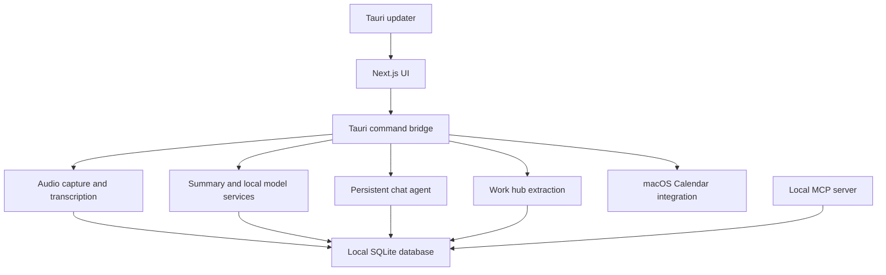

# Orxa Architecture

Orxa is a Tauri desktop app with a Next.js UI and a Rust backend. The supported application path is the bundled desktop app; the archived Python backend is not used for normal development or release.

## Runtime Shape



## Frontend

The frontend lives in `frontend/src`.

Key surfaces:

- `app/calendar/page.tsx` merges macOS Calendar events with local recordings.
- `app/chat/page.tsx` provides persistent meeting-aware chat.
- `app/meeting-details` displays transcripts, summary modal, recording playback, trim tools, and work hub.
- `app/settings` configures recordings, transcription, summaries, chat, playback, beta features, and MCP setup.
- `components/Sidebar` owns the main navigation, recording actions, search, and update notice.

## Rust Backend

The Tauri backend lives in `frontend/src-tauri/src`.

Key modules:

- `audio` handles recording, import, device handling, and transcription persistence.
- `calendar.rs` wraps macOS EventKit for permission, auto-start, and event listing.
- `summary` generates and stores summaries and action-oriented outputs.
- `chat.rs` stores local agent chat sessions and messages.
- `workhub.rs` extracts actions, decisions, risks, questions, role outputs, and context packs.
- `mcp.rs` exposes MCP setup information to the UI.
- `database` owns the SQLite schema, migrations, and repositories.

## Data Model

The local SQLite database stores:

- meetings
- transcript segments
- summary processes and summary payloads
- chat sessions/messages
- work items and context packs
- settings and model preferences

Calendar events are read from macOS Calendar at view time. Orxa attaches recordings to events by comparing event start/end times with the recording start and inferred recording duration.

## Update Flow

Tauri updater artifacts are created by GitHub Actions. The app checks:

```text
https://github.com/Reliability-Works/orxa-meetings/releases/latest/download/latest.json
```

When an update is available, the sidebar shows a persistent notice. Download progress is shown in the sidebar and the update modal. The app relaunches after installation.

## Agent Access

The local MCP server in `mcp/orxa_mcp.py` reads the same local SQLite database. Agents can inspect transcripts, summaries, notes, action items, and context packs without using the archived backend.

The MCP server is intentionally local and file-based. It does not expose secrets or model-provider API keys.
